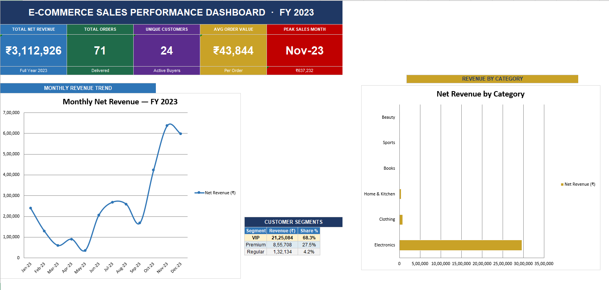
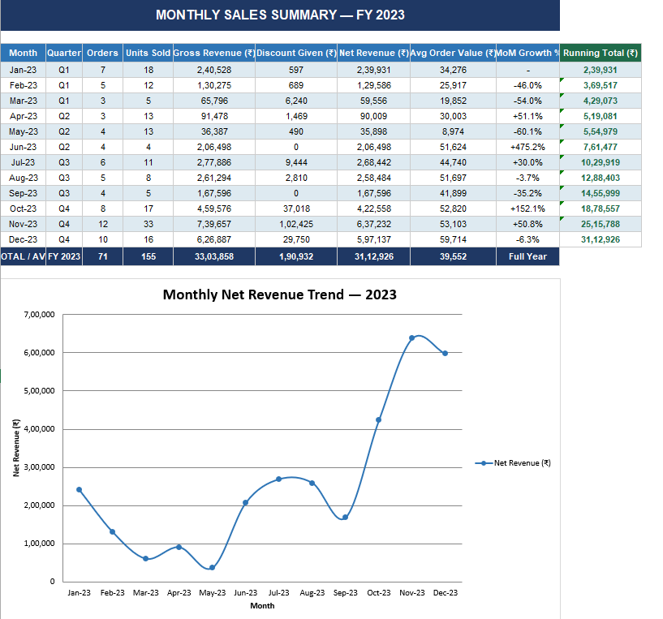
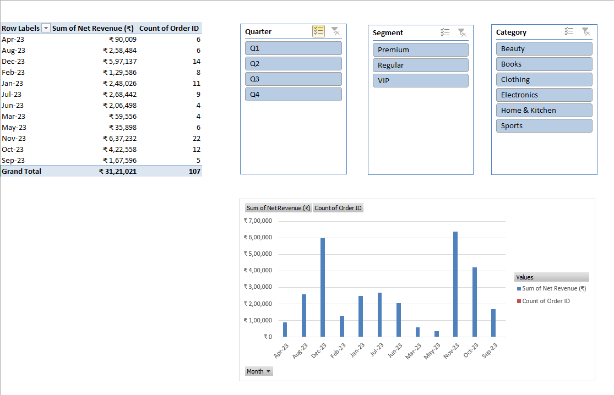
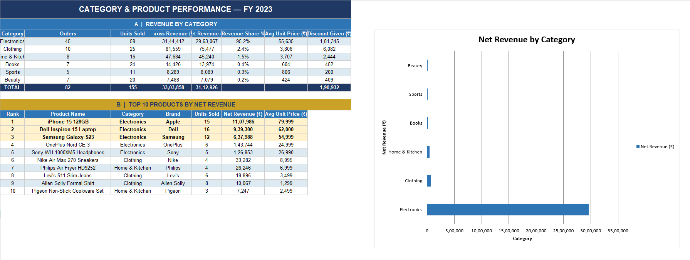
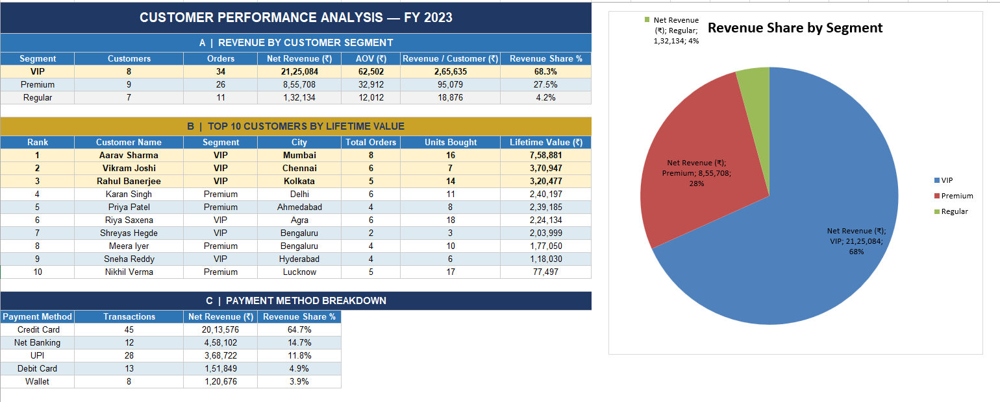
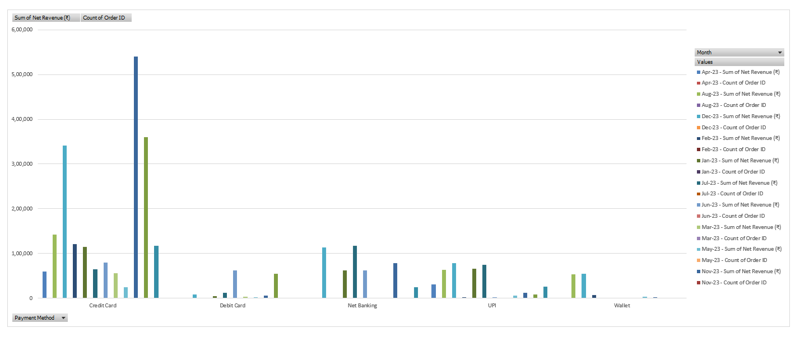
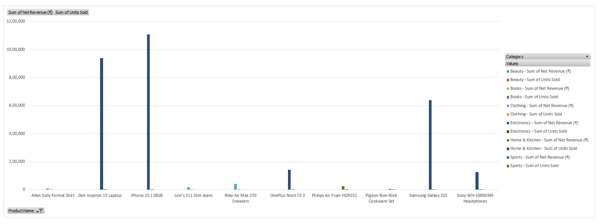
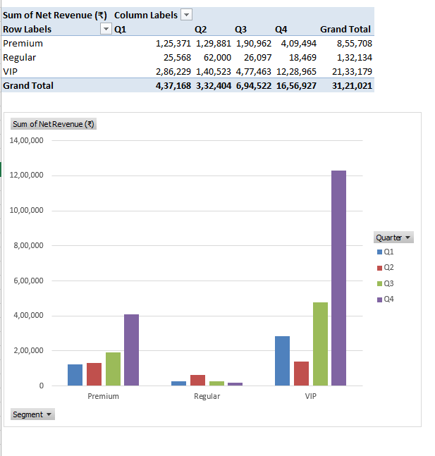
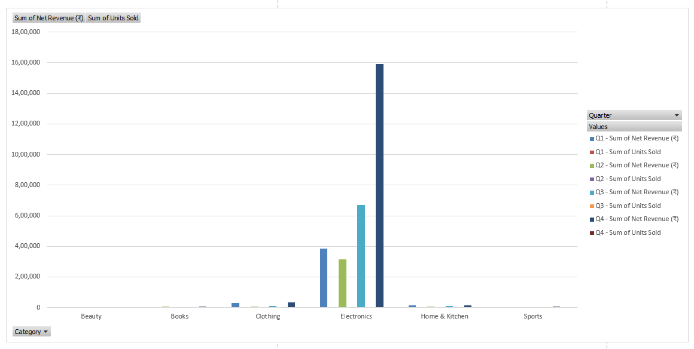

# 📊 Sales Performance Dashboard (Microsoft Excel)

An interactive Sales Performance Dashboard built entirely in Microsoft Excel to analyze sales performance, customer behavior, product trends, and payment insights.

The dashboard transforms raw transactional data into business-ready insights using Pivot Tables, Pivot Charts, Slicers, Excel formulas, conditional formatting, and KPI cards.

---

# Dashboard Preview
**KPI Dashboard**
<br><br>

<br><br>
**Monthly Summary**
<br><br>

<br><br>
**Monthly Revenue Trend**
<br><br>

<br><br>
**Category Analysis**
<br><br>

<br><br>
**Customer Analysis**
<br><br>

<br><br>
**Payment Analysis**
<br><br>

<br><br>
**Top 10 Products by Revenue**
<br><br>

<br><br>
**Customer Segment**
<br><br>

<br><br>
**Category Breakdown**
<br><br>

<br><br>
---

# Project Objective

The goal of this project is to demonstrate how Microsoft Excel can be used as a Business Intelligence tool for analyzing sales data and creating interactive dashboards without writing code.

The dashboard enables business users to:

- Monitor overall sales performance
- Track revenue trends over time
- Analyze product category performance
- Identify top-selling products
- Understand customer purchasing behavior
- Evaluate payment preferences
- Monitor key business KPIs

---

# Business Questions Answered

✔ What is the total revenue generated?

✔ How many orders were completed?

✔ What is the Average Order Value (AOV)?

✔ Which product categories generate the highest revenue?

✔ Which products contribute most to sales?

✔ How does revenue change month over month?

✔ Which customer segments generate the highest revenue?

✔ Which payment methods are most frequently used?

✔ What are the monthly sales trends?

---

# Dashboard Features

### Executive KPI Dashboard

- Total Revenue
- Total Orders
- Average Order Value
- Unique Customers
- Peak Sales Month

---

### Monthly Revenue Analysis

- Monthly Revenue Trend
- Month-wise comparison
- Revenue growth visualization

---

### Category Analysis

- Revenue by Product Category
- Sales Contribution
- Category Comparison

---

### Customer Analysis

- Customer Segmentation
- Revenue Share by Segment
- Revenue by Customer Segment
- Top 10 Customers by Lifetime Value 
- Payment Method Breakdown

---

### Product Analysis

- Top 10 Products
- Highest Revenue Products

---

### Payment Analysis

- Payment Method Distribution
- Revenue by Payment Type

---

# Excel Skills Demonstrated

### Data Cleaning

- Data validation
- Missing value handling
- Structured tables

### Excel Functions

- SUMIFS
- COUNTIFS
- IF
- LOOKUP
- INDEX-MATCH
- TEXT
- DATE Functions
- Percentage calculations

### Pivot Tables

- Revenue Analysis
- Customer Analysis
- Product Analysis
- Payment Analysis

### Dashboard Design

- Interactive Slicers
- KPI Cards
- Pivot Charts
- Dynamic Reports
- Conditional Formatting
- Professional Layout

---

# Tools Used

- Microsoft Excel
- Pivot Tables
- Pivot Charts
- Slicers
- Conditional Formatting
- Excel Formulas

---

# Repository Structure

```
sales-performance-dashboard-excel
│
├── dataset
│   └── raw dataset.xlsx
├── excel
│   └── Sales_Performance_Dashboard.xlsx
├── screenshots
│   ├── category-analysis.png
│   ├── category-breakdown.png
│   ├── customer-analysis.png
│   ├── customer-segment.png
│   ├── kpi-dashboard.png
│   └── monthly-revenue-trend.png
│   └── monthly-summary.png
│   ├── payment-analysis.png
│   └── top-10-products.png
└── README.md
```

---

# How to Use

1. Download the Excel workbook.
2. Open it using Microsoft Excel (2019 or Microsoft 365 recommended).
3. Enable editing if prompted.
4. Navigate through the dashboard sheets.
5. Use slicers to interactively filter the dashboard.

---

# Key Excel Concepts Demonstrated

- Business Dashboard Development
- Data Analysis
- Data Visualization
- KPI Reporting
- Sales Analytics
- Customer Analytics
- Interactive Reporting
- Dashboard Design

---

# Project Highlights

- Built an end-to-end interactive Excel dashboard.
- Created multiple analytical reports from raw sales data.
- Designed executive KPI cards for business monitoring.
- Implemented interactive filtering using slicers.
- Developed dynamic Pivot Table reports and visualizations.
- Applied professional dashboard formatting for stakeholder reporting.

---

## Author

**Amey Shinde**

Aspiring Data Analyst

Skills:
- SQL
- Microsoft Excel
- Power BI
- Data Visualization
- Business Analytics
